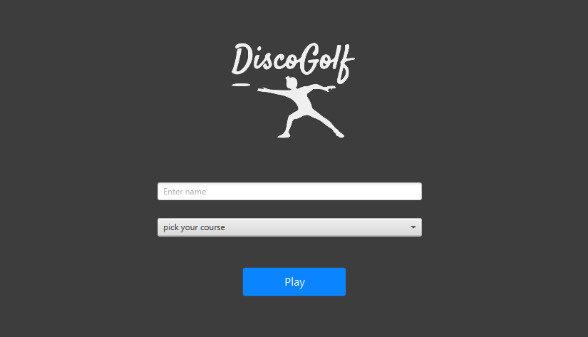
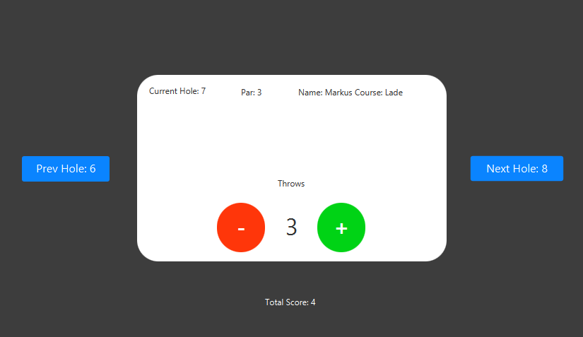

[](https://gitpod.stud.ntnu.no/#https://gitlab.stud.idi.ntnu.no/it1901/groups-2022/gr2224/gr2224)

# README

## Content

A companion application for discgolfing at the Trondheim local courses; Lade and Dragvoll.
The repository contains:

- Documentation
  - A contract between the members of the application team
  - This readme file
  - PlantUML diagram
- Configuration Files
  - Pom.xml files for Maven modules
  - Checkstyle configuration files
  - Spotbugs configuration files
  - Jacoco configuration files
- Tests
  - Junit5 test cases for the logic
  - TestFX test cases for the GUI
- Several Maven modules
  - Json module for data persistence with Jackson library
  - Core module with the logic classes for the application
  - UI module with the GUI classes for the application: controllers, fxml files and the AppClass for running the application
  - FXUtil module for future use

## Navigation through repository content

The application exists within the discogolf directory at path:

```gr2224/discogolf/```

and the application can be run from the DiscoGolfApp directory at path:

```gr2224/discoGolf/ui/src/main/java/ui/DiscoGolfApp.java```

The data is stored in a .json file (database.json) at the user's home directory:
```C:/Users/username/database.json```

## How to run the application and tests using Maven

All maven commands must be run from the ```/discoGolf/``` directory:

- To run the application: ```mvn javafx:run -pl ui```
- To run the tests: ```mvn test```

## UI design

The UI currently consists of two pages: Main page (before started game) and Scorecard page (during started game). Below is two screenshots which is representative of the current state of the UI.





## Architecture

Interaction with the application is described in the following diagram:
(Kjør inn plantUML diagram her)
