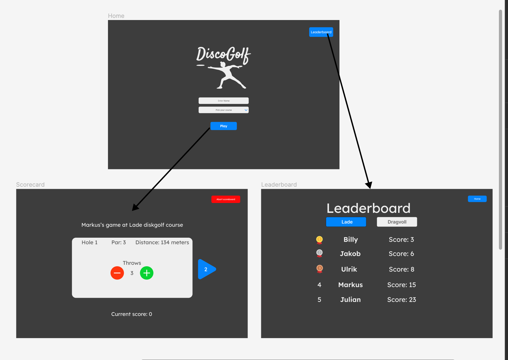

# DiscoGolf app

We have created an app for people who play disc golf in Trondheim. Disc golf is a sport very similar to golf, but where you throw frisbees, also known as discs. When you start a round you enter your name and pick a course. One course usually consists of 9 or 18 holes, where each whole has a value for expected throws (called par). The purpose of the app is for people to track their throws for each hole, so they can get their total score.

The app will contain a HOME screen where you can either start a game, which leads you to the SCOARECARD screen. From the homescreen you can also click on "leaderboard" button, which leads you to the LEADERBOARD screen. This screen contains a leaderboard over the games played on the app.

## The app designed in Figma:

# User Stories

## Playing a discgolf game

A person wants to play a disc golf game in Trondheim with his friends. He doesn't want to write down all the throws on a piece of paper, but rather track his game digitally.

### What should the app show

* How many holes the chosen course have
* Which hole number the user is currently on
* The par for current hole
* How many throws the user have on current hole
* The total score for the user so far in the game

#### What should the app do

* The opportunity to choose a course and start a game
* Add and remove throws on current hole
* Go to next and previous hole
* Submit and save scorecard when the user is on the last hole

## Checking the leaderboard after a game

After playing a discGolf game Magnus wants to compare himself with his friends, who have also used the app. First, he plays a game at his local course at "Dragvoll", and records the game in the app. Then he goes to the leaderboard page by clicking on the "Leaderboard" button, where he can see his total score compared to his friends.

### What should the app show

* Give the user some feedback when submitting a game, so they know it was saved to the leaderboard.
* A leaderboard page that shows a sorted leaderboard based on total score for all the saved games.
* The leaderboard should also show the player names for the games, so it is easy to recognize your own name or someone you know.

#### What should the app do

* The opportunity to choose between courses to display the wanted leaderboard.
* Opportunity to go back to the main page.