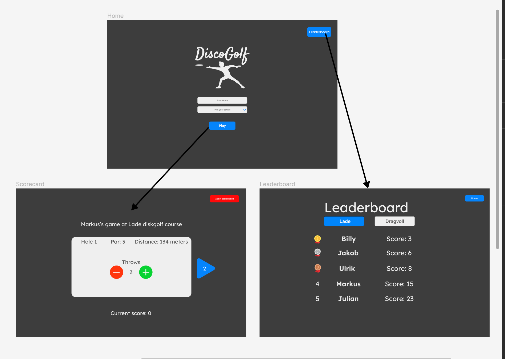
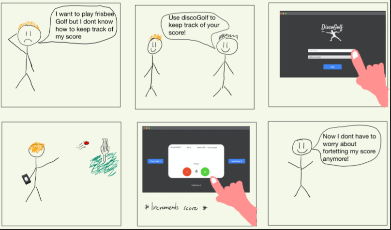

# DiscoGolf app
We are going to create an app for people who plays disc golf in Trondheim. Disc golf is a sport very similar to golf, but where you throw frisbees, also known as discs. When you start a round you enter your name and pick a course. One course usually consists of 9 or 18 wholes, where each whole have a value for expected throws (called par). The purpose of the app is for people to track their throws for each hole, so they can get their total score. 

The app will contain a HOME screen where you can either start a game, which leads you to the SCOARECARD screen. From the homescreen you can also click on "leaderboard" button, which leads you to he LEADERBOARD screen. This screen contains a leaderboard over the top 50 best games played on the app. 

The app designed in Figma:

# User-history
Here is a user history where a person uses the current main funcionality in the app, using the scoerecard to track the total score of a disc-golf round.

