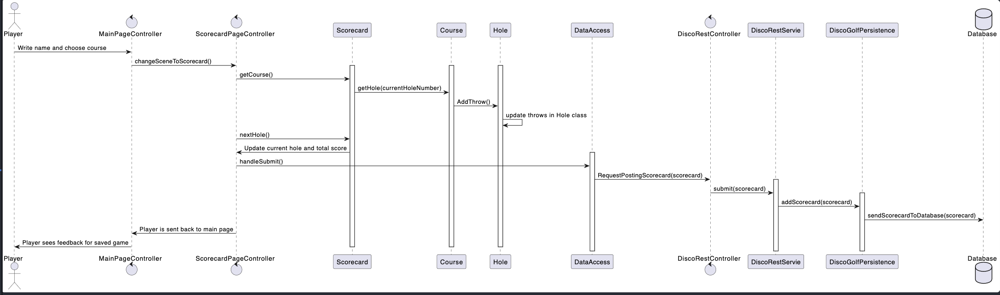
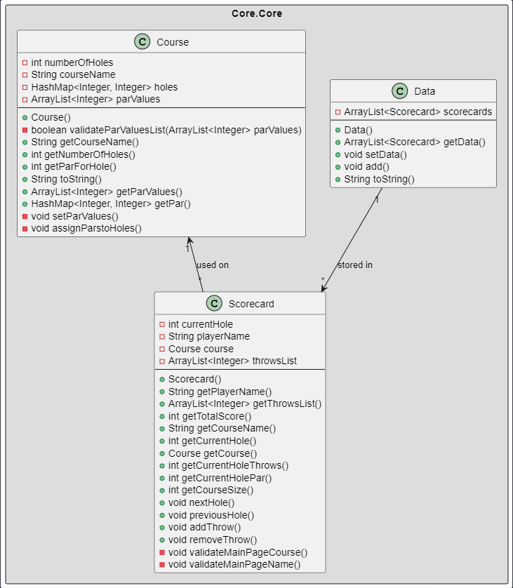

# Release 3

## New features

This release we have implemented the following features:

* New Leaderboard page that displays the leaderboard for the chosen course,and sorts based on totalScore, bestHole and playerName. Also gives the user feedback when no games are saved.
* Cancel button for canceling a started game. When clicked, the user is taken back to the main page, and the game is discarded.
* New feedback to user when trying to start a game with either an invalid player name or not a selected course.
* Added constrains when the throw count for a hole is 1, the red "minus" button is then disabled.
* New restApi module that uses rest API to save games on an external server....?

## Project architecture and modularisation

The code architechture has been improved by following the Maven standard. The code is now split into more modules, which are all located in the discoGolf directory. The modules are:

* ui
* core
* restApi
* integrationTest

### UI

UI is the module which contains all the JavaFX related code.
This module contains all the controllers and the DiscoGolfApp.java class.
All fxml and UI- layer related code is located here.

### Core

This module is the physical representation of the logic layer of the application. All logical classes are located here. This module is divided into two submodules, which are:

* core.core
* json

#### core.json

This submodule contains all the classes that handle the data-persistence in the application (serializing and deserializing the data, to and from JSON). The module is heavily reliant on the Jackson library. In detail it contains three pairs of serializers and deserializers, which are:

* CourseSerializer.java and CourseDeserializer.java
* ScorecardSerializer.java and ScorecardDeserializer.java
* DataArraySerializer.java and DataArrayDeserializer.java

These serializers are loaded into a Disco Golf module which is used to add the (de)serializers to the ObjectMapper. The main class of this module is Discogolf persistence.java, which is used to load and save the data from the database. This class together with its methods handle all interaction with the database.json file.

#### core.core

This submodule contains all the classes that are used to represent the data in the application. It contains the central logic in the application. The classes are:

* Course.java
* Data.java
* Hole.java
* Leaderboard.java
* LeaderboardComparator.java
* Scorecard.java
* ScorecardDAO.java
* ScorecardInterface.java

Multiple of these classes were added this sprint for both supporting new features, and for improving code quality and structure. Hole.java was implemented because the Scorecard.java class had too much logic, which lead to the class being chaotic. Therefore, we created the Hole class for controlling throws, score and par for each hole. We also created the Leaderboard.java class for organizing the scorecard object saved in the data base in a hashMap. This class used the new LeaderboardComparator that compares two scorecard objects based on totalScore, bestHole and playerName. This way, all the scorecard containing the same course could easily be sorted in a list. Since we only needed to save the information for sorting objects for the leaderboard, we also decided to create a new ScorecardDAO class. This class does not contain any logic, only the relevant information saved in the database used for sorting the objects. Since the two scorecard classes had many similar methods, we created a ScorecardInterface which they both implements. Another benefit from this is when other classes uses Scorecard and ScorecardDAO objects. Then the ScorecardInterface can be used as datatype for allowing both instances.

### RestApi

The restApi module contains....?

### IntegrationTest

The integrationTest module containts.....?

## Workflow

In this release we have continued to use the principles from the last sprint, but also implementes some new principles. We have also improved when it comes to consisnency and coordinatation within the team. Under are the techniques we have used descirbed in more detail.

### Issues

In the project we used issues in gitlab for dividing the project in to appropiate tasks. Each issue had an assigne with the main responsibility, but we often worked together (pair-programming) for better understanding and efficiency. Each issue also had labels for issue size, priorty and type of task. The issues contained an description of what was supposed to be done in the task as well. Also, when creating large issues, we often used multiple subissues to divide the task into more managable sub-tasks. Under is a list of all the labels we used during the project.

#### Labels

* Checkstyle/Spotbugs
* Code-review
* Documentation
* Logic-layer
* Modularity and Structure
* Persistence-layer
* Rest-API
* Testing
* UI-layer
* Type: Bug
* Type: Feature
* Priority: Low, Medium or High
* Size: S, M or L

#### Boards

We used the board feature in gitlab to divide the issues into four categories. By doing so, everyone had a clear understading at all times, what was going on in the project. The different categories used:

* Open (before someone has started working on the issue)
* Ongoing (when someone is currently working on the issue)
* Code review (when the issue is done and a merge is requested)
* Closed (when the code is reviewed, and the merge is completed by someone else than the person responsible for the issue)

### Branches

In sprint 3 we used the issues in gitlab to create branches. This way, all the branches were named with the issuenumber at beginning, followed by the issue header. When creating sub-issues we created sub-branches out of the main-issue branch. When a branch was done, the responsible person for the issue created a merge request for mergin the branch into dev. In sprint 3, we decided to create a new dev branch that we treated as the main branch for this sprint. This way, we made sure we did not ruined anything in the master branch and that it worked at all times.

### Commits

During this sprint we continued to implement a 3-part structure in our commit messages. The 3-part structure consisted of a short subject line where you briefly describe the commit, a body where you describe the changes that were made and why, and a footer for authors and issuenumber. This implementation greatly enhanced our repository structure and made it easier to get an overview over the previous commits when that was needed.

## Code quality

For release-3, several libaries are used to ensure good code quality for the project:

* Checkstyle
* spotbugs
* jacoco (code coverage)
* pipeline

## Tests

## PlantUML diagrams

Under are three different diagrams to show the strcuture of our app. A classdiagram that shows the interaction and connection between the core classes. A sequence diagram for showing how the app works when playing a game of disc golf, and then saving the game. Finally a package diagram to show the overall structure and connection of the app.

