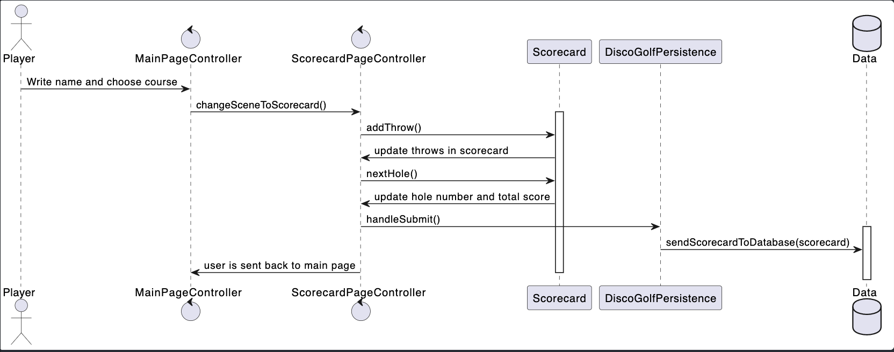

# Release 2

## New features

This release we have implemented the following features:

* The submit button on the scorecard scene now saves the scorecard to the database in json format.

## Project architecture and modularisation

The code architechture has been improved by following the Maven standard. The code is now split into multiple modules, which are all located in the discoGolf directory. The modules are:

* fxutil
* ui
* core

### PlantUML diagram

Class diagram

Sequence diagram

### fxutil

This module is not in use yet, but it is a module which will be used later.
It is a maven prepared module based on further expansion of the application in release 3/4

### UI

UI is the module which contains all the JavaFX related code.
This module contains all the controllers and the DiscoGolfApp.java class.
All fxml and UI- layer related code is located here.

### core

This module is the physical representation of the logic layer of the application. All logical classes are located here. This module is divided into two submodules, which are:

* core.core
* json

#### json

This submodule contains all the classes that handle the data-persistence in the application (serializing and deserializing the data, to and from JSON). The module is heavily reliant on the Jackson library. In detail it contains three pairs of serializers and deserializers, which are:

* CourseSerializer.java and CourseDeserializer.java
* ScorecardSerializer.java and ScorecardDeserializer.java
* DataArraySerializer.java and DataArrayDeserializer.java

These serializers are loaded into a Disco Golf module which is used to add the (de)serializers to the ObjectMapper. The main class of this module is Discogolf persistence.java, which is used to load and save the data from the database. This class together with its methods handle all interaction with the database.json file.

#### core.core

This submodule contains all the classes that are used to represent the data in the application. It contains the central logic in the application. The classes are: Course.java, Scorecard.java and Data.java. Data.java was added as a supporting class to the application, to make it easier to handle the data in the database. The class is used to store the scorecard in the database.json file as a list. There is only one Data.java object in the database.json file, and it is located at root level.

## Workflow

This release was heavily affected by major changes in project architecture. This resulted in a significant
need of logistic planning and structure. The team has decided to use the Kanban board in GitLab (milestones), to improve workflow and structure. We used this tool actively to make sure that we established an overview of which issue was assigned to each team member. has also decided to use the GitLab issue system to create issues for each task. This has resulted in a more structured workflow, and has made it easier to keep track of the project progress.

In the middle of the sprint we started linking each issue to its own branch. Every branch resolves a issue and when closed on merge, the issue is resolved. This made sure that our code was always up to date with the issues we were working on, and that the master branch always was stable. On merges we used another teammember as a reviewer to make sure that the code was up to the standards of the team. Isolating each issue in a branch made sure that we could work on multiple issues at the same time, without having to worry about conflicts.

The team were more commited to the practice of pair-programming on large issues. This proved to be very effective when issues became complex. This was also a good way to make sure that the team was able to learn from each other, and that everyone was able to contribute to the project.

## code quality

For release-2, several libaries were implemented in the project, to ensure good code quality:

* Checkstyle
* spotbugs
* jacoco (code coverage)
