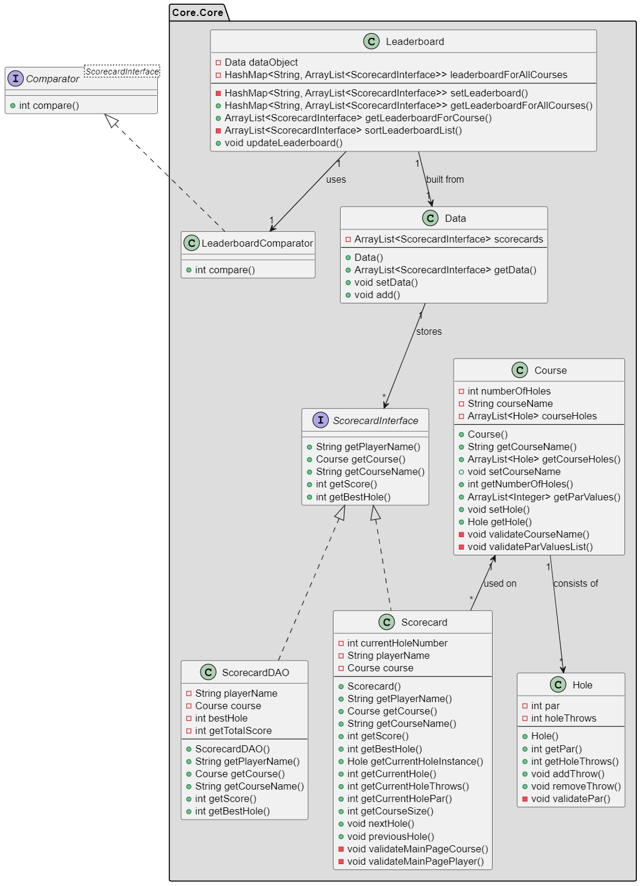
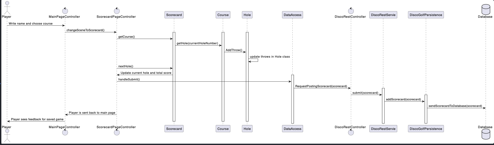
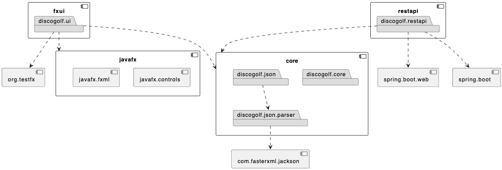

# Release 3

This is the documentation for release 3 of the discoGolf application project.

## New features

in Release 3 we have implemented the following features:

* `Leaderboard` functionality:
  * This is implemented in the UI at a Leaderboard page which displays the leaderboard for a chosen course.
  * The leaderboard sorts submited scorecards based on their totalScore-field, bestHole-field and playerName-field.
  * The leaderboard is updated when a new scorecard is submitted to the server.
  * If the leaderboard for a given course is empty (contains no submitted scorecards), the leaderboard page will display a message saying so, giving visual feedback.
* A cancel button for canceling a started game:
  * When clicked, the user is taken back to the main page, and the game is discarded (not submitted to server).
* Visual feedback when application fails to start a game:
  * This will occur if the user enters an invalid player name or if the user haven't selected a course.
* Constraints at scorecard UI when the throw count for a hole is 1:
  * The constraint is added to indicate that the user cant have less than one throw per hole.
  * The constraint is the disabling of the red "minus" button.
* A `restapi module` that implements the `Springboot Rest API`:
  * The module contains a runnable Springboot server application.
  * The server maintains a database.json file that contains all submitted scorecards, as a Data JSON object.
  * The communication with the server from client side is done through the DataAccess objects.
* A `DataAccess` class for communicating with the server from client side:
  * The communication is done through HTTP requests.
* `ScorecardDAO` and `ScorecardInterface` classes, that makes communication between server and client more lightweight:
  * DAO stands for Data Access Object.
  * ScorecardDAO objects are compressed representations of Scorecard objects, and only holds the necessary information, that is needed for reading and writing from/to database.json.
* A `Hole` class which handles the logic for a single hole in a game.

## Project architecture and modularisation

The code architecture has been improved by modularising the project even more. The code is divided into more modules, which are all located in the discoGolf directory. The project includes the following modules:

* ui
* core
* restapi

### UI

UI is the module which contains all JavaFX related code (FXML files, controllers and the javaFX application). UI is the physical representation of the UI-layer, and is responsible for running the applications User Interface, allowing user communication with the backend.

### core

The core module contains all logical classes, and is divided into two directories:

* core.core
* json

#### core.json

This directory is the physical representation of the persistence layer. The directory contains classes for converting Java objects to and from Json objects, and is heavily dependent on the Jackson library. The json directory contains another directory called parser, which contains three pairs of Jackson serializers and deserializers:

* CourseSerializer.java and CourseDeserializer.java
* ScorecardSerializer.java and ScorecardDeserializer.java
* DataArraySerializer.java and DataArrayDeserializer.java

These serializers are loaded into a DiscoGolfModule.java class which is used to link the (de)serializers to the ObjectMapper. The most important class of this directory is DiscoGolfPersistence.java. This class uses an ObjectMapper to parse objects to the correct corresponding Java/Json format, initially loading and saving information in the database.json file. DiscoGolfPersistence handle all interaction with the database.json file, and is therefore directly responsible for all persistence related tasks.

#### core.core

This directory is the physical representation of the logic-layer in this application. it contains all the classes that are used to represent and manipulate the data in the application:

* Course.java
* Data.java
* Hole.java
* Leaderboard.java
* LeaderboardComparator.java
* Scorecard.java
* ScorecardDAO.java
* ScorecardInterface.java

Multiple of these classes were added this sprint for both supporting new features, and for improving code quality and structure. This release we were focused on implementing the SOLID principles, which is the reasoning behind some of our new classes:

* Hole.java was implemented to fulfill the single responsibility principle.
  * The class inherited its responsibilites from the release 2 Scorecard.java class, making both classes "single purposed".
  * The class keeps track of number of throws, score and par at each hole, which means less responsibility for the Scorecard class.
* The Leaderboard.java class added additional functionality for organizing the scorecard objects saved in the database in a HashMap.
  * This class used the new LeaderboardComparator that compares two scorecard objects based on totalScore, bestHole and playerName. This way, all the scorecards containing the same course could easily be sorted in a list.
* We only need to store enough information to fill a leaderboard, we created a class called ScorecardDAO.java.
  * This class does not contain any logic, only the relevant information to be stored in the database used for sorting the objects.
* Since the two scorecard classes had many similar methods, we created a ScorecardInterface which they both implement.

### restapi

The restapi module implements a restful API called springboot. This API is hosted by a standalone server application, which recieves instructions from the client as HTTP requests at a specified URI. The client communicates with the server through the DataAccess.java class (located in ui). This class formulates HTTP requests and fills the request body with the appropriate information, before they are sent to the rest-server URI. When requests are sent via the API the server will decide precicely what happens based on the URI of the request, and the servers response will always consist of the server interacting with the database via DiscoGolfPersistence.java in core.json.

## Workflow

In this release we continued to use the principles from the last sprint, but we also implemented some new principles. We have  improved our consistency and coordination within the team. The techniques we have used is described more in detail underneath.

### Issues

In the project we used issues in gitlab for dividing the project into appropriate tasks. Each issue had an assigne with the main responsibility, but we often worked together by pair-programming, for better understanding and efficiency. Each issue also had labels for issue size, priority, type of task and which domain/layer it belongs to. The issues contained a description of what was supposed to be done in the task as well. When creating large issues, we often used multiple subissues to divide the task into more manageable sub-tasks. One of the many advantages of using issues was that we could associate commits with the issues, which made it easier to track the progress of the project.

Underneath is a list of all the labels we used during the project.

#### Labels

* Checkstyle/Spotbugs
* Code-review
* Documentation
* Logic-layer
* Modularity and Structure
* Persistence-layer
* Rest-API
* Testing
* UI-layer
* Type: Bug
* Type: Feature
* Priority: Low, Medium or High
* Size: S, M or L

#### Boards

Gitlab has a Kanban board tool, which we used to divide the issues into four states. By doing so, everyone had a clear understanding at all times, what was going on in the project.

The different states:

* Open (before someone has started working on the issue)
* Ongoing (when someone is currently working on the issue)
* Code review (when the issue is done and a merge is requested)
* Closed (when the code is reviewed, and the merge is completed by someone else than the person responsible for the issue)

### Branches

In sprint 3 we used the issues in gitlab to create branches. This way, all branches were named with the issue-number at beginning, followed by the issue-title. When creating sub-issues we created sub-branches out of the main-issue branch. When a branch was done, the responsible person for the issue created a merge request for merging the branch into dev (or some other parent branch). The dev branch is a branch that we treated as the main branch for this sprint. This allows the master branch to be stable and bug free at all times, such that we would always have a production ready version of the project.

### Commits

During this sprint we continued to use a 3-part structure in our commit messages. The 3-part structure consisted of a short subject line where the commit is briefly described, a body where you describe the changes that were made and why, and a footer containing the commit author(s) and issue number. This greatly enhanced our repository structure and made it easier to get an overview over the previous commits when that was needed.

## Code quality

For release-3, several libraries are used to ensure good code quality for the project:

* Checkstyle (checkstyle-maven-plugin) ensures that the code is written in the same format, is clean and understandable. People write code in different ways, and this plugin ensures that the code is written in a consistent way.

* Spotbugs (spotbugs-maven-plugin) ensures that there are no instances of bug patterns in the program, which are likely to be errors.

* Jacoco (jacoco-maven-plugin) ensures good test coverage for the code. Generally speaking, test coverage above 80% is good coverage. Our goal was a coverage of 90% or higher, which we managed to achieve.

## Tests

Each module has its own tests. For the core module we used J-Unit. We used TestFX combined with J-unit to test the controllers in the UI module. In the restapi module we used the SpringBootTest library to be able to run and send requests to the server.

## PlantUML diagrams

Under are three different diagrams that describes the structure of some modules and processes in our application:

* Classdiagram that shows the interaction and connection between the core classes.
* Sequencediagram for showing how the app works when playing a game of disc golf, and then saving the game.
* Package diagram to show the overall structure and connection between modules of the app.

### Class diagram

### Sequence diagram

### Package diagram

